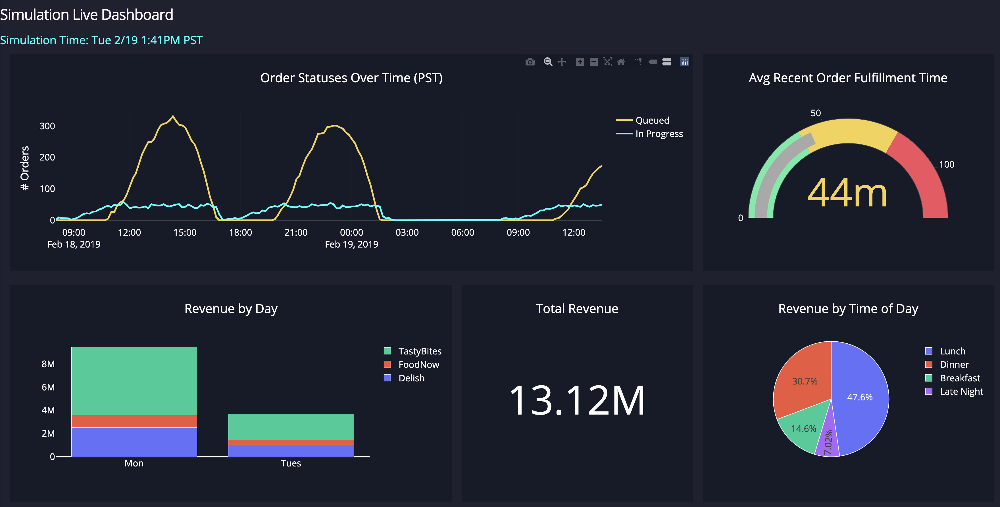

# Overview
This app simulates the real-time processing of food orders received by one kitchen. An order may have multiple items, and the kitchen has a fixed number of cooks who can each cook one item at a time. If no cooks are available, the items are added to a queue and processed in order as soon as a cook becomes free. The number of cooks and simulator speed are configurable.

All data needed for this simulation is stored in [simulator/data](./simulator/data/), but the system runs as if orders are received in real time, i.e. no part of the system is allowed to access future orders from the orders.json file.

As the simulator runs, it stores order data in a local SQLite database that is shared with a Flask app running on a separate thread. The Flask app displays a data dashboard giving real-time insight into operational and business metrics while the simulation is running.

The analytics dashboard looks like this:


# Run the Simulation Locally
## Requirements
Docker and the docker-compose CLI need to be installed on your machine. For best results, increase your Docker Desktop resources above their default levels.

## How to Run
1) From the top level directory, run the following:
```bash
docker-compose up --build
```
2) Open a web browser to [localhost:8050](http://localhost:8050/)
3) (Optional) Change the parameters in [parameters/simulation_parameters.py](./parameters/simulation_parameters.py) and re-run steps 1 and 2 to see how the simulation changes

## Testing
Tests are very easy to run:
```bash
make unittest
```

Tests are run via their own docker-compose file, which in turn uses Dockerfile.test files for each service. This allows us to mount the same volumes and thus create the same filesystem used to run the application, which is necessary for module imports to work correctly in our test cases. This also allows us to run tests for both services from one place.

# App Architecture
The app runs two distinct processes: the order simulator and an analytics dashboard web app. The processes communicate via a shared SQLite database: the order simulator writes to this database and the dashboard reads from it. This separation of concerns allows each process to run with an independent OS, filesystem, and hardware resources such that one could be scaled independently of the other so long as they both communicate via the shared database. The processes are networked via a simple docker-compose file which also mounts a parameters file to each process for convenience in defining all system parameters in one place.

## Order Simulator
The order simulator uses a framework called [SimPy](https://simpy.readthedocs.io/en/latest/) which is helpful in emulating real-time order processing with a fixed number of resources (cooks). The simluation is defined by a series of generator functions that pass orders to a kitchen object which has a set number of resources defined. The orders are split into their component items such that an order may have its items processed in parallel, yet the generator functions retain enough state information to know when the entire order is complete. Items each have their own predefined cook times, and items are queued in order if resources are unavailable.

Along the way, the SQLite database is updated for each order at 3 distinct points: when the order is received, when the first item from the order starts being cooked, and when the last item from the order finishes being cooked. Updating the database 3 times per order gives us real-time insight into current order statuses, but each of these timestamps are stored independently to allow for historical analysis of orders that have already been completed.

## Dashboard
The dashboard runs inside of a Flask app using an open-source library called [Dash](https://plotly.com/dash/) which is a high-level framework built on top of D3 and React. Dash is flexible enough that it would be very easy to extend this dashboard to include custom visualizations, filters, etc. or embed it inside of a larger Flask application.

The data powering the dashboard is re-queried every 5 seconds (by default) using a predefined set of analytical SQL Queries, one per chart. The query results are in most cases pulled into a Pandas dataframe, which allows for further transformation as necessary and interfaces well with the Dash API.
